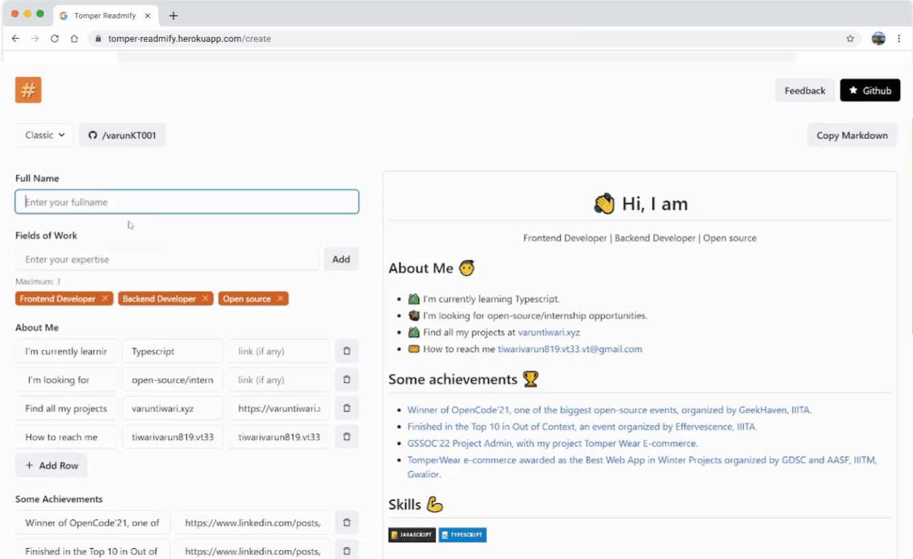

<p align='center'>

</p>
<p align='center'>
<b>Create your Profile README
using the best Templates</b>
</p>
<p align='center'>
<a href='https://tomper-readmify.onrender.com/' target='_blank'>tomper-readmify.onrender.com</a>
</p>

---

<p align='center'>
This is the frontend + backend of TomperReadmify build with MERN stack and deployed with <a href='https://render.com/' target='_blank'>Render</a>
</p>

<p align='center'>

</p>

## 🚀 Visit [TomperReadmify](https://tomper-readmify.herokuapp.com/)

## 🧾 Description

A simple editor allows you to easily add and customize all the sections you need for your profile's readme.

## ✨ Features

Users creating their profile's README through this platform enjoys following features:

- [x] Easy to interface.
- [x] No markdown knowledge is required.
- [x] Various themes to suit every user's need.
- [x] Addons like Github Streaks, Github Stats, Profile Views, etc., each with a variety of themes.
- [x] Feedback can be provided by users.
- [x] Responsive for all screen sizes.

## ⚙ Tools and Technologies used

#### Client

1. [React.js](https://reactjs.org/)
2. [Typescript](https://www.typescriptlang.org/)
3. [Redux-Toolkit](https://redux-toolkit.js.org/)
4. [Chakra-UI](https://chakra-ui.com/)
5. [Marked](https://marked.js.org/)
6. [DOMPurify](https://www.npmjs.com/package/dompurify)
7. [React-icons](https://react-icons.github.io/react-icons/)
8. [Formspree](https://formspree.io/)

#### Backend

1. [Node.js](https://nodejs.org/en/)
2. [Express.js](https://expressjs.com/)
3. [Typescript](https://www.typescriptlang.org/)
4. [@varuntiwari/express-ts-decorators](https://www.npmjs.com/package/@varuntiwari/express-ts-decorators)

## 🛠 Installation and setup

1. Clone the repo to your local machine.
2. Install the required dependency for the client and the server using :

   ```javascript
   npm run installScripts
   ```

3. Start the dev server using :

   ```javascript
   npm run dev
   ```

## 🏎 Creating production built

1. Create a production ready MERN app using the command :

   ```javascript
   npm run build
   ```

## 😎 Made with  by

<table>
  <tr>
    <td align="center">
      
      <br/>
      Varun Kumar Tiwari
      <br/>
      2020IMT-112
      <br/>
      <a href="https://www.linkedin.com/in/varun-tiwari-454591178/">LinkedIn</a>
      <a href="https://github.com/varunKT001">Github</a>
    </td> 
  </tr>
</table>

## ⚖ License

[GPL-3.0](./LICENSE.md)

<br>
<br>
<br>

<p align='center'>
(If you liked the project, give it a star 😃)
</p>
